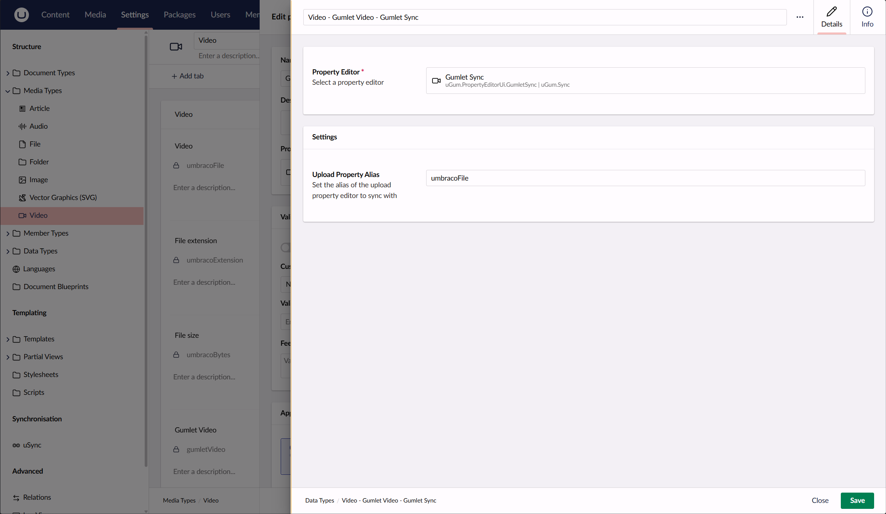
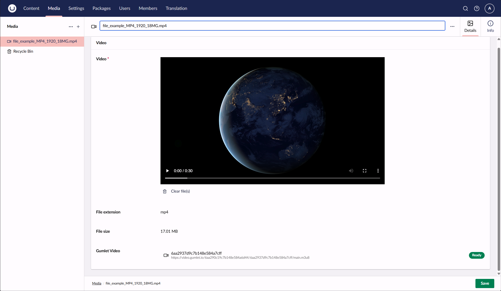

# uGum

uGum synchronizes video files uploaded to Umbraco with Gumlet. When an Umbraco item is saved, uGum uploads the configured video file to Gumlet and stores the resulting Gumlet asset ID and HLS playback URL on the item.

## Requirements

- Umbraco CMS 18 or newer
- A Gumlet Video workspace
- A Gumlet API key with permission to create, read, and delete video assets
- The Gumlet video source ID used for ingestion

## Installation

Install the NuGet package in your Umbraco project:

```sh
dotnet add package Umbraco.Community.uGum
```

The package registers the **Gumlet Sync** property editor and the required Umbraco notification handlers automatically.

## Get the Gumlet API key and source ID

1. Sign in to the [Gumlet dashboard](https://dash.gumlet.com/).
2. Open **Developer → API keys**.
3. Select **Create API key**, give the key a recognizable name, and select **Video Admin**.
   uGum needs permission to create and upload video assets, read their processing status, and delete the corresponding Gumlet asset when a video is replaced or removed in Umbraco. **Video Developer** may be sufficient for some operations, but **Video Admin** is the recommended role for the complete uGum workflow. Do not use **Video Readonly** or **Video Analyst**.
4. Copy the key immediately and store it securely. It is used as a Bearer token and should not be committed to source control.


The `SourceId` is the Gumlet video workspace/source used for ingestion. In the Gumlet dashboard, open the relevant video workspace and use **Copy workspace ID** next to the workspace name. Use that value as `SourceId` in the uGum configuration.


For more details, see Gumlet's [API key documentation](https://docs.gumlet.com/developers/api-keys) and [direct upload documentation](https://docs.gumlet.com/developers/vod-developers-section/direct-upload).

## Configuration

Add the Gumlet settings to `appsettings.json`:

```json
{
  "Umbraco": {
    "Gumlet": {
      "ApiKey": "YOUR_GUMLET_API_KEY",
      "SourceId": "YOUR_GUMLET_SOURCE_ID",
      "Format": "hls",
      "Resolution": [
        "240p",
        "360p",
        "480p",
        "720p",
        "1080p"
      ],
      "KeepOriginal": false
    }
  }
}
```

The API key and source ID can also be supplied as environment variables:

```text
Umbraco__Gumlet__ApiKey=YOUR_GUMLET_API_KEY
Umbraco__Gumlet__SourceId=YOUR_GUMLET_SOURCE_ID
```

`Format` defaults to `hls`. `Resolution` controls the renditions Gumlet creates, and `KeepOriginal` controls whether Gumlet keeps the original uploaded file after processing.

## Add the Gumlet Sync property editor

1. Open the media, content, or member type that contains the video upload property.
2. Add a new property using the **Gumlet Sync** property editor.
3. In **Upload Property Alias**, enter the alias of the upload property containing the video file.
4. Save the schema and upload or save a video.



The sync property should be placed on the same type as the upload property. On save, uGum uploads the file to Gumlet. If the upload is replaced, the old Gumlet asset is deleted and a new one is created. When the Umbraco item is deleted, its associated Gumlet asset is deleted as well.



## Stored value

The property editor stores a JSON value that is exposed to published models as `GumletValue`:

```json
{
  "Src": "/media/example-video.mp4",
  "GumletAssetId": "65b169dfe99b77f116c0e4aa",
  "PlaybackUrl": "https://video.gumlet.io/workspace/asset/main.m3u8"
}
```

The value contains:

- `Src` — the original Umbraco upload value.
- `GumletAssetId` — the asset ID in Gumlet.
- `PlaybackUrl` — the HLS playback URL returned by Gumlet.

## Playback

`PlaybackUrl` can be passed to any video player that supports HLS. For example:

```cshtml
@if (Model.Video?.GumletVideo is { PlaybackUrl: not null } video)
{
    <video controls src="@video.PlaybackUrl"></video>
}
```

For browsers that do not support HLS natively, use an HLS-capable player such as hls.js.

## Troubleshooting

- **No asset is created:** verify `ApiKey`, `SourceId`, and the `Upload Property Alias` value.
- **The status remains Preparing:** Gumlet is still processing the video. The backoffice editor polls the asset status automatically.
- **The property is empty:** make sure the upload and Gumlet Sync properties are on the same Umbraco type and that the uploaded value is a video file.
- **Playback does not start:** confirm that the asset has reached the `ready` state and that the player supports HLS.

uGum uses Gumlet's direct-upload API. The Gumlet API key is only used server-side and is never exposed to the browser.
